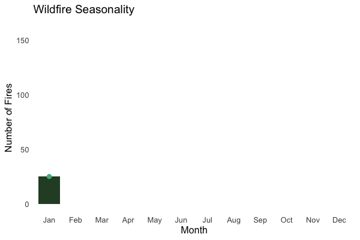
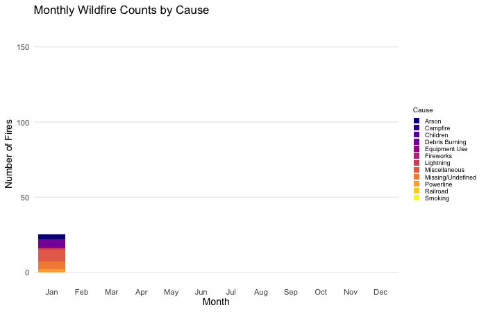
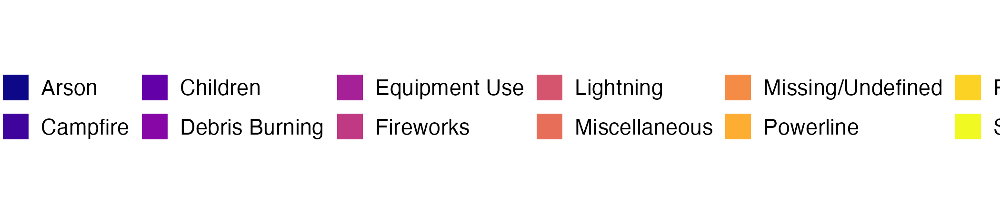
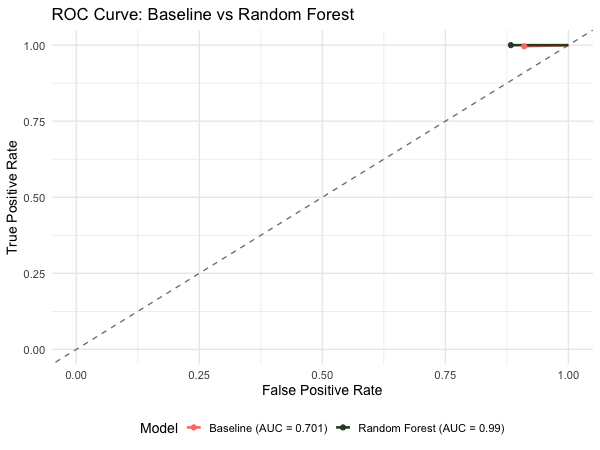
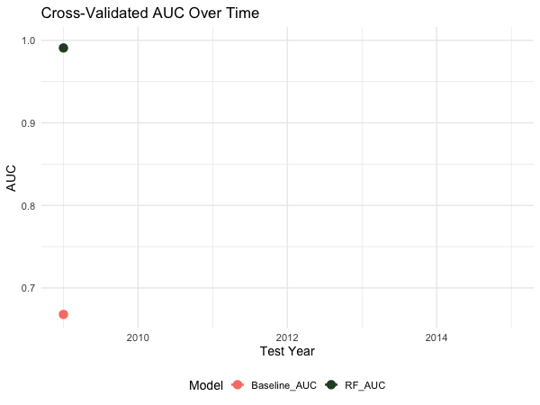

---
output:
  xaringan::moon_reader:
    lib_dir: libs
    self_contained: true
    nature:
      highlightStyle: github
      highlightLines: true
      countIncrementalSlides: false
---
class: title-slide
background-image: url(https://i.pinimg.com/736x/bc/61/ac/bc61aca2d944ca77de4856474f668145.jpg)
background-size: cover
background-position: center

<div style="position: absolute; top: 50%; left: 10%; right: 10%; transform: translateY(-50%); background-color: rgba(255,255,255,0.3); padding: 20px; border-radius: 10px; text-align: center;">
  <h1 style="color: white;">From Creation to Prevention, Predicting Wildfire Incidences in the United States. </h1>
  <h2 style="color: white;">Ashika Lakkaraju</h2>
  <h2 style="color: white;">March 2026</h2>
  <h3 style="color: white;font-size: 26px;">STA 141A | Made with Xaringan</h3>
</div>

---

```{r setup, include=FALSE}
knitr::opts_chunk$set(echo = TRUE)
library(lubridate)
wildfires <-read.csv(file = "../Data/wildfires_sample_100k.csv")
library(tidyverse)
library(kableExtra)
library(gganimate)
library(gifski)
```

# <span style="color: #2d6a4f;">Abstract</span>  
----
Across the continental United States, there are records of over 188 Million wildfires dating back to 1992.  

The goal of this analysis is to successfuly adapt a model that predicts **the probability of a wildfire occurring in a location during a certain time.**

The **objective** explores the influence of **main causes** of notable fires paired with **time and location**. There is a lack of exploration in finding connections between **causes, seasonality, and location of fires.** By investigating the past, we are able to create predictions and be proactive for the future. 

- **Main method** $\rightarrow$ Identify notable fires, analyze trends, evaluate predictor models 
- **Predictor Models** $\rightarrow$ Logistic Regression (Baseline) & Random Forest
- **Key Results** $\rightarrow$ Random Forest performed better at 97.9% accuracy 
- **Takeaway** $\rightarrow$ Seasonality and Geographic location can significantly help predict fire risk before it occurs

---

# <span style="color: #2d6a4f;">Background</span>   
----
.pull-left[
  ***Why should we focus on wildfires?***

Like most natural disasters, wildfires are **complicated but compelling**. They are both destructive to an environment while necessary to protect it. However, **in light of climate change**, longer dry periods and higher temperatures lead to longer and larger fires. When left unchecked, they are dangerous and ecosystem enders.  

By being able to predict **where and when fires occur** can help with:
- Educating and informing communities about risks
- Firefighters who need to understand the constraints
- Estimating when another fire can start next 
]

.pull-right[
  
]


---

class: inverse, center, middle
background-color: #2c4a2e

# Data Preprocessing
<p style="color: white; font-size: 22px;">Preparing the dataset for modeling.</p>

---

# <span style="color: #2d6a4f;">Data Preparation</span>  
----
.pull-left[
<span style="color: #2d6a4f;">**Identifying Notable Fires**</span>  
- Defined as a fire &ge; 300 acres and is the chosen cut-off
- By removing small wildfires, the data is less skewed (smaller fires are more frequent)
- Entire dataset is filtered by their size

<span style="color: #2d6a4f;"> **Space-Time Units**</span> 
- Constructed by combining 
  - YY-MM-DD
  - The cause of the fire
  - Latitude and longitude of the origin
- By arranging the dataset in this order, we can built a binary classifier
]

.pull-right[
<span style="color: #2d6a4f;">**Defining the Binary Variable**</span> 
- Did at least one notable wildfire occur in that state in that month? 
  - `1` = Yes 
  - `0` = No 
- Includes main cause and average size of the fire 
- Better visualization where the biggest fires on average happen in a state in a given month 

<span style="color: #2d6a4f;">**Temporal Coverage**</span> 
- Training data: 1992–2008 
- Test data: 2009–2015
- The dataset is roughly split 70/30
- Includes both fire and non-fire datapoints 
]

---

# <span style="color: #2d6a4f;">Predictors and Missing Data</span>  
----
.pull-left[
<span style="color: #2d6a4f;">**Chosen Predictors**</span> 
- `STATE` — geographic variation
- `FIRE_MONTH` — seasonal patterns
- `FIRE_YEAR` — long-term seasonality
- `MAIN_CAUSE` - reason for fire 
- `AVG_SIZE` - average size of fire 
- `avg_lat` / `avg_lon` — mean coordinates of fires

These predictors are **intentional**, because it sets up further understanding into how causes of fires can affect their size and seasonality. This connection is further investigated in the exploratory analysis. Including model improvements. 
]

.pull-right[
<span style="color: #2d6a4f;">**Missing Data**</span> 
- Non-fire months have no coordinates → filled with state average lat/lon
- `main_cause` is `NA` for non-fire months → labelled *"No Fire"* 
- Ultimately, all missing values get filtered out

Initially, there was trouble with the prediction models to accurately split the testing and training data because of the interference of missing values. A binary outcome of `0` meant there was no fire, therefore no data. **This leakage was fixed** by replacing `avg_lat/avg_long` as 0. This made sure no fires are accompanied with no location. 
]
---

# <span style="color: #2d6a4f;">Summary Table</span>  
----
```{r echo=FALSE}
library(knitr)
summary_table <- data.frame(
  Variable = c("STATE", "FIRE_YEAR", "FIRE_MONTH", "avg_lat", 
               "avg_lon", "main_cause", "avg_size", "num_fires", "fire_occurrence"),
  Type = c("Categorical", "Numeric", "Factor", "Numeric", 
           "Numeric", "Categorical", "Numeric", "Numeric", "Binary"),
  Description = c(
    "US state",
    "Year of observation (1992–2015)",
    "Month of observation (1–12)",
    "Mean latitude of fires in group (state avg if no fire)",
    "Mean longitude of fires in group (state avg if no fire)",
    "Most frequent fire cause in state-month group",
    "Mean fire size in acres (fires ≥ 300 acres only)", 
    "Number of fires recorded in state-month group",
    "1 = at least one fire occurred, 0 = no fire"
  ),
  Role = c("Predictor", "Predictor", "Predictor", "Predictor",
           "Predictor", "Predictor", "Predictor",  "Derived", "Outcome"),
  Missing = c("None", "None", "None", "Imputed with state average", 
              "Imputed with state average", "Filled as No Fire", 
              "Filled as 0", "Filled as 0", "None")
)

kable(summary_table, format = "html",
      table.attr = "style='width:100%; font-size:16px;'") %>%
  kableExtra::row_spec(which(summary_table$Role == "Predictor"), 
                       background = "#d4edda") %>%
  kableExtra::row_spec(which(summary_table$Role == "Outcome"),
                       background = "#fff3cd")
```

<p style="font-size:20px; color:#2c4a2e; margin-top:10px;">
  Final dataset contains <b>12,096 state-month observations total</b> over <b>24 years (1992–2015)</b>, 
  filtered to notable fires &ge; 300 acres with a maximum recorded size of <b>344,833 acres</b>.
</p>
---

class: inverse, center, middle
background-color: #2c4a2e

# Exploratory Data Analysis
<p style="color: white; font-size: 22px;">Investigating how causes of fires relate to location, seasonality, and size.</p>

---
# <span style="color: #2d6a4f;">Notable Wildfires in the US</span>  
```{r echo=FALSE, fig.width=10, fig.height=6, warning=FALSE, message=FALSE}
ggplot() +
  geom_polygon(data = us_map, aes(x = long, y = lat, group = group),
               fill = "gray95", color = "white") +
  geom_point(data = cont_fires,
             aes(x = avg_lon, y = avg_lat, color = main_cause, size = avg_size),
             alpha = 0.8) +
  scale_color_viridis_d(option = "plasma") +
  scale_size_continuous(range = c(1, 5)) +
  labs(color = "Cause", size = "Average Fire Size") +
  coord_fixed(1.3) +
  theme_minimal(base_size = 10) +
  theme(axis.title = element_blank(), axis.text = element_blank(),
      axis.ticks = element_blank(), panel.grid = element_blank(),
      legend.position = "bottom",
      legend.direction = "horizontal",
      legend.box.margin = ggplot2::margin(-40, 0, 0, 0),
      legend.key.size = unit(0.7, "lines"),
      legend.text = element_text(size = 9),
      legend.title = element_text(size = 10)) +
guides(color = guide_legend(nrow = 2))
```

<p style="font-size:13px; text-align:center; color:#2c4a2e; margin-top:2px;">
Investigating fire cause and size reveals that most notable wildfires stretch from the <b>Pacific Northwest</b> to the <b>Southeast</b>. Lightning dominates the PNW while the SE sees primarily Arson and Miscellaneous causes. A distinct cluster near the <b>Appalachian Mountains</b> shows Arson and Campfires, which correlates to camping activities. The largest fires are mostly near Washington and Montana along the <b>Rocky Mountains</b>, suggesting that while western fires are mostly <b>natural</b>, other high-risk fires have <b>preventable</b> origins.
</p>

---
# <span style="color: #2d6a4f;">Wildfire Seasonality</span>  

.pull-left[

]

.pull-right[
<div style="font-size:14px; line-height:1.6;">

🌱 <b>Spring (Mar–Apr)</b><br>
Fires begin rising → dry vegetation and more turbulent weather patterns.

<br>🌧 <b>Sudden drop in May</b><br>
Possible external reason considering May is the transition between Spring and Summer.

<br>🔥 <b>Summer (Jun–Aug)</b><br>
Peak fire season → hot, dry conditions likely fuel the spread of fires.

<br>❄️ <b>Winter (Nov–Jan)</b><br>
Activity drops sharply as moisture returns and temperatures cool.
<br>
<br><span style="color:#2c4a2e;">By understanding <b>seasonality as it relates to the frequency</b> of notable fires, it will help navigate what months to begin risk preparation. This graph compiles the average data from all years, which means this is <b>trend is cyclical in nature</b>. Leading it to be a <b>strong predictor</b> for the model to use in the future.</span> 

</div>
]

---
# <span style="color: #2d6a4f;">Monthly Wildfire Counts by Cause</span>

.pull-left[


]

.pull-right[
<br>
⚡ **Lightning** surges in summer months (Jun-Aug) as main driver of fires

🔥 **Arson & Burning Debris** are relatively evenly spread which makes sense as it is not a natural cause and can happen year round 

🌿 **Spring** Equipment use and debris burning peak in Mar-Apr 

<span style="color:#2c4a2e; font-size:16px;">This plot is helpful in understanding whether there is a <b>correlation between seasonality and cause</b>. It links to the previous graph and aligns with the meteorological trends. An example is noticing how <b>lightning causes more fires</b> in the summer because of <b>rising temperatures and dry vegetation</b>.</span>
]

---
# <span style="color: #2d6a4f;">Wildfire Hotspots in the US</span>
```{r echo=FALSE, fig.width=10, fig.height=5.5, warning=FALSE, message=FALSE}
ggplot() +
  geom_polygon(data = us_map, aes(x = long, y = lat, group = group),
               fill = "gray95", color = "white") +
  stat_density_2d_filled(data = cont_fires,
                         aes(x = avg_lon, y = avg_lat), alpha = 0.8) +
  scale_fill_viridis_d(option = "magma") +
  labs(fill = "Fire Density") +
  theme_minimal(base_size = 10) +
  theme(panel.grid = element_blank(), axis.title = element_blank(),
        axis.text = element_blank(), axis.ticks = element_blank(),
        legend.key.size = unit(0.6, "lines"),
        legend.text = element_text(size = 8),
        legend.title = element_text(size = 9))
```

<p style="font-size:18px; text-align:center; color:#2c4a2e; margin-top:2px;">
For the sake of plot readability, Alaska and Hawaii have been omitted. There are two main hotspots shown in the graph. The <b>Pacific Northwest</b>and the <b>Southeast</b>. This confirms that <b>geography and location</b> are strong predictors of fire occurrence for the model. It also <b>validates the graph of notable fires</b> by emphasizing the density of fires on average in a heatmap.</p>
---
class: inverse, center, middle
background-color: #2c4a2e

# Model Fitting
<p style="color: white; font-size: 22px;">After exploring the underlying patterns in the data, it's time to evaluate models.</p>

---
# <span style="color: #2d6a4f;">Model Specification</span>
----
.pull-left[
### <span style="color: #2c4a2e;">Logistic Regression (Baseline)</span>

<div style="font-size:12px; line-height:1.6;">
**Logistic regression** models the **probability** of fire occurrence as a function of FIRE_MONTH. It draws a decision boundary to classify months as fire or no-fire in a binary classification where the outcome is simply 0 or 1. 

<br>
**Why this as the baseline?**
- A more traditional approach for its simplicity 
- Captures seasonal patterns with a only single predictor
- Establishes a performance benchmark to improve on
</div>
```{r echo=FALSE, fig.height=2, fig.width=3, warning=FALSE, message=FALSE}
library(ggplot2)
x <- seq(-6, 6, length.out = 200)
y <- 1 / (1 + exp(-x))
df <- data.frame(x = x, y = y)

ggplot(df, aes(x, y)) +
  geom_line(color = "#2c4a2e", linewidth = 1.5) +
  geom_hline(yintercept = 0.5, linetype = "dashed", color = "gray50") +
  annotate("text", x = 4, y = 0.55, label = "Decision\nBoundary", size = 3, color = "gray40") +
  annotate("text", x = -4, y = 0.1, label = "No Fire", size = 3, color = "#2c4a2e") +
  annotate("text", x = 4, y = 0.9, label = "Fire", size = 3.5, color = "#2c4a2e") +
  labs(x = "FIRE_MONTH (linear predictor)", y = "P(fire occurrence)") +
  theme_minimal(base_size = 10)
```
]

.pull-right[
### <span style="color: #2c4a2e;">Random Forest (Chosen Model)</span>

<div style="font-size:12px; line-height:1.6;">
<b>Random Forest</b> builds <b>500 decision trees</b>, each trained on a random subset of data and predictors. Final prediction is made by majority vote across all trees.

</div> 
<div style="font-size:10px; line-height:1.6;">
<br><b>Established Predictors:</b>
STATE · FIRE_YEAR · FIRE_MONTH · avg_lat · avg_lon
<br><b><i>NOTE:</b> FIRE_CAUSE was was omitted due to data leakage. It provides no information for no fires. Retained for exploratory analysis only.</i>
</div>

<div style="font-size:11px; line-height:1.6;">
<br><b>Why Random Forest as the Chosen Model?</b>
- More popular for predictor models because its easier to interpret 
- Good for non-linear relationships and evaluating multiple predictors 
</div> 
```{r echo=FALSE, fig.height=2, fig.width=3, warning=FALSE, message=FALSE}
library(ggplot2)
ggplot() +
  geom_segment(data = edge_df,
               aes(x = x, xend = xend, y = y, yend = yend),
               color = "gray60", linewidth = 0.8) +
  geom_point(data = tree_df, aes(x = x, y = y),
             size = 10, color = "#2c4a2e", alpha = 0.85) +
  annotate("text", x = 0.5, y = 1.15,
           label = "One of 500 Trees", size = 3.5,
           color = "#2c4a2e", fontface = "bold") +
  xlim(0, 1) + ylim(0.1, 1.3) +
  theme_void()
```
]

---
class: inverse, center, middle
background-color: #2c4a2e

# Model Validation
<p style="color: white; font-size: 22px;">Evaluating the performance of both models using a temporal split on historical data.</p>

---
#<span style="color: #2d6a4f;">Summary of Model Performance</span>
.pull-left[
```{r echo=FALSE, warning=FALSE, message=FALSE}
library(knitr)
library(kableExtra)

perf_table <- data.frame(
  Model    = c("Logistic Regression", "Random Forest"),
  Accuracy = c("92.57%", "97.87%"),
  AUC      = c("0.701", "0.989")
)

kable(perf_table, format = "html", align = "c") %>%
  kable_styling(font_size = 18, full_width = TRUE) %>%
  row_spec(0, background = "#2c4a2e", color = "white") %>%
  row_spec(1, background = "#f5f5f5") %>%
  row_spec(2, background = "#e8f5e9", bold = TRUE, color = "#2c4a2e") %>%
  column_spec(1.5, bold = TRUE)
```

<br>
<div style="font-size:14px; line-height:1.6;">
<b>Validation:</b> Temporal 70/30 split<br>
- Temporal splits follow the natural progression of time unlike randomized splits which wouldn't work for historical data. This assures the model is being as reasonable as possible with handling real fire risks. 
<b>Train:</b> 1992–2008 (8,568 rows)<br>
<b>Test:</b> 2009–2015 (3,528 rows)<br>
- This means 70% of the data used to train the model is equivalent to studying for a test. The other 30% is measuring to see if the model actually retained the information it was built on like taking the test and scoring.
<br>
<br><span style="color:#2c4a2e;"><b>Random Forest successfully outperforms the baseline across both metrics.</b></span>
</div>
]

.pull-right[
```{r echo=FALSE, fig.height=4, fig.width=5, warning=FALSE, message=FALSE}
imp_df <- as.data.frame(importance(rf_model))
imp_df$Variable <- rownames(imp_df)

ggplot(imp_df, aes(x = reorder(Variable, MeanDecreaseGini),
                   y = MeanDecreaseGini)) +
  geom_col(fill = "#2c4a2e", alpha = 0.85) +
  coord_flip() +
  labs(title = "Variable Importance",
       x = "", y = "Mean Decrease Gini") +
  theme_minimal(base_size = 12) +
  theme(panel.grid.major.y = element_blank())
```

<div style="font-size:12px; line-height:1.5; margin-top:5px;">
<b>What is Variable Importance?</b><br>
For random forest, it measures how each predictor <b>contributes to the overall accuracy</b>. A higher score means the variable is more critical for correct classification. 
<br>
<br><b>avg_lon and avg_lat</b> dominate which confirms <b>geography is the strongest indicator</b> for predicting wildfire occurrence. It's more specific than STATE (South California is more susceptible to fires than the North). It shows <b>the model can understand spatial patterns<b> and not just generalized areas. 
</div>
]

---
# <span style="color: #2d6a4f;">Diagnostic Plots</span>

.pull-left[

<p style="font-size:14px; text-align:center; color:#2c4a2e; margin-top:2px;">
- The ROC curve shows how accurately the model is able to label fire vs no fire over time.
<br> - True Positives are actual fires while False Positives are false alarms. Too many False Positives is <b>Type 1 error.</b>
<br> - The Random Forest <b>(AUC = 0.989)</b> outperforms the baseline <b>(AUC = 0.701)</b>. 
<br> - The Random Forest curve indicates near perfect classification while the baseline performs only slightly better than if it just guessed randomly.
</p>
]

.pull-right[

<p style="font-size:14px; text-align:center; color:#2c4a2e; margin-top:2px;">
- The AUC curve calculates the area under the ROC curve on a scale of 0 to 1.
<br> - AUC remains consistently near to 1 across all test years for the Random Forest while the baseline hovers around 0.70. 
<br> - This confirms the model generalizes well over time <b>while maintaining proper performance</b> as time progresses.
</p>
]

---
class: title-slide
background-image: url(https://i.pinimg.com/736x/3e/77/35/3e773518d5213f92a064d1a783724e75.jpg)
background-size: cover
background-position: center

<div style="position: absolute; top: 4%; left: 4%; right: 4%; bottom: 4%; background-color: rgba(255,255,255,0.65); padding: 35px; border-radius: 10px;">

<h2 style="color:#2c4a2e; margin-bottom:15px;">Summary</h2>

<div style="display: grid; grid-template-columns: 1fr 1fr; gap: 25px; font-size:16px; line-height:1.9;">

<div>
<b style="color:#2c4a2e;">Key EDA Insights</b><br>
- Explored if <b>timing, location, and cause of wildfires</b> can predict where and when notable fires are likely to occur across the US. <br>
- Analysis revealed wildfires mainly concentrate along the <b>Pacific Northwest to Southeast corridor.</b><br>
- Fire activity peaks in <b>June–August</b> → <b>hotter climate and dry vegetation</b> <br>
- <b>Lightning</b> mainly dominates Western fires while <b>Arson</b> and drive Southeastern fires<br>
- The largest fires cluster near the <b>Rocky Mountains</b>. → natural causes amplify fire size in drier regions <br> 
- <b>Appalachian Mountains</b> → more preventable causes 
</div>

<div>
<b style="color:#2c4a2e;">Model Performance & Evaluation</b><br>
- The Random Forest model achieves <b>97.87% accuracy</b> and an <b>AUC of 0.989</b> compared to the baseline's 92.57% accuracy and AUC of 0.701<br>
- Geography (<b>avg_lat, avg_lon</b>) is the strongest predictor of fire occurrence<br>
- <b>Main Cause omitted</b> from final prediction due to data leakage in binary outcomes <Br>
- The model is able to understand <b>specific geographical occurrences</b> using spatial units compared to state <br>
- The model generalizes well over time with <b>no degradation</b> in performance across 2009–2015<br>
- <b>Takeaway</b> → understanding seasonality and location can help <b>anticipate fire risk</b> before it occurs
</div>

</div>
</div>
---

class: title-slide
background-image: url(https://i.pinimg.com/736x/83/f7/b2/83f7b285bfdd1bed08e3f87303a9d918.jpg)
background-size: cover
background-position: center

<div style="position: absolute; top: 50%; left: 10%; right: 10%; transform: translateY(-50%); background-color: rgba(255,255,255,0.7); padding: 20px; border-radius: 10px; text-align: center;">
  <h1 style="color: #2c4a2e;">Thank you!</h1>
  <h3 style="color: #2c4a2e; font-size: 26px;">STA 141A | Made with Xaringan</h3>
  <p style="color: #2c4a2e; font-size: 16px;">
    <a href="https://www.kaggle.com/datasets/rtatman/188-million-us-wildfires/data" target="_blank" style="color: #2c4a2e;">Link to Dataset</a>
    &nbsp;&nbsp;|&nbsp;&nbsp;
    <a href="https://github.com/alakkaraju/wildfire-analysis-prediction" target="_blank" style="color: #2c4a2e;">Link to GitHub Repository</a>
  </p>
</div>
